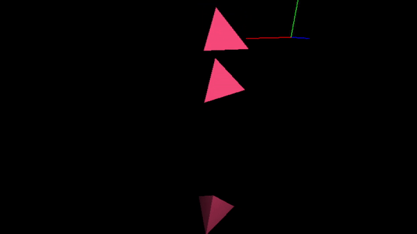
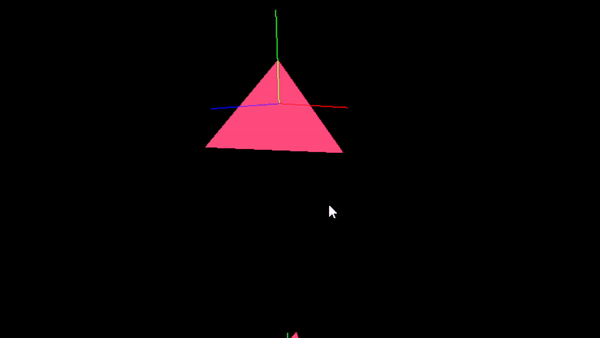
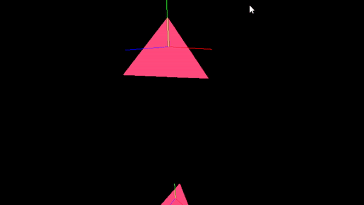

# Software Rasterizer and Physics Solver

- [x] From Scratch
- [x] Self derived formulas for collision detection

## Rendering
- [x] Line Rendering
- [x] Triangle Rasterization
	- [x] Triangle Shading
	- [x] Light sources

Color + Light Shaded Triangles bound to colloding Tetraeders:

## Physics
- [x] Bouding Sphere Collisions
- [x] Tetraeder-Tetraeder Collisions
- [x] Continous Collision detection and resolution

### 100 Hz Collision

### 5 Hz Collision
The same collisions at the same points!

